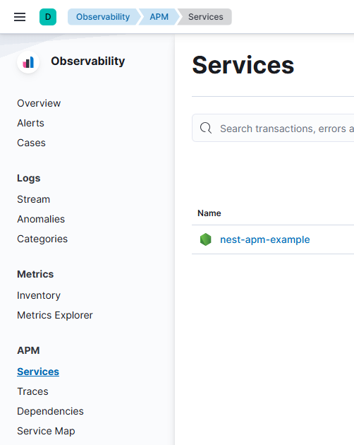
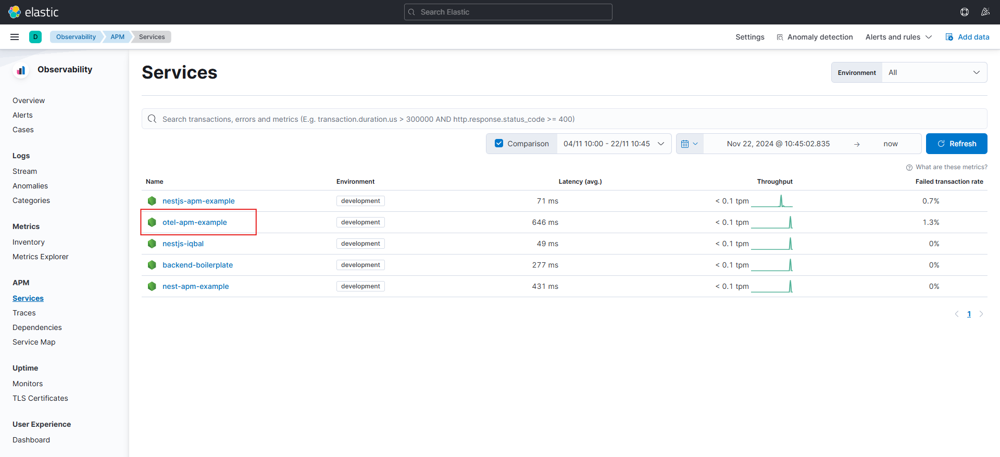
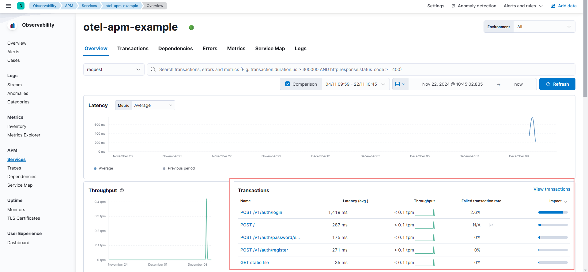
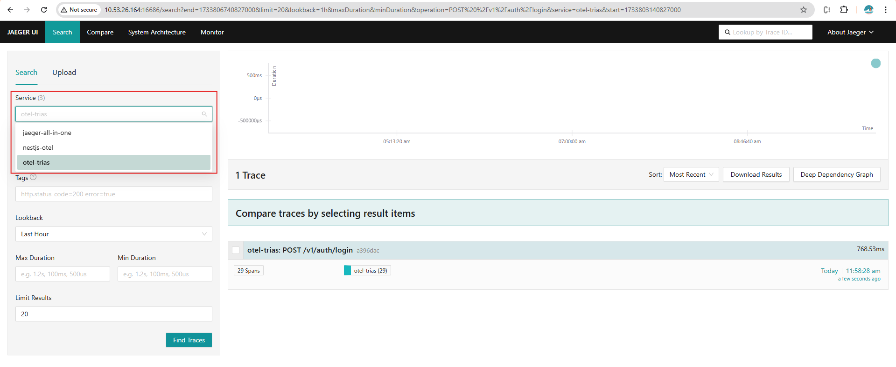

# Backend Application Documentation

## Table of Contents
- [Introduction](#introduction)
- [Technologies Used](#technologies-used)
- [Setup and Installation](#setup-and-installation)
- [Environment Variables](#environment-variables)
- [API Endpoints](#api-endpoints)
- [Database](#database)
- [Testing](#testing)
- [Observabilty](#observability)


---

## Introduction
This is the backend of an application that ensures single-session login in each device type, desktop or mobile using session that stored in [MongoDB](https://www.mongodb.com/). Built using [NestJS](https://nestjs.com/) and [PostgreSQL](https://www.postgresql.org/), it serves as the backbone for secure and efficient data management.

## List Feature
- **Role Management**
   - List Role
   - Update Role
   - Delete Role
- **User Management**: 
   - List User logged in (filter by `is_logged_in`)
   - List User banned (filter by `is_banned`)
   - List User Activities 
- **User Authentication**
   - Register
      - Ensure email and username are unique 
      - Password are strong (must include numbers, uppercase and lowercase letters, and special characters)
      - Also password is being encrypt and decrypt with [Crypto](https://www.npmjs.com/package/crypto-js)
   - Login
      - Only one session running in each device type, mobile or desktop. User can't login because session already exist
      - If you fill in the wrong password more than 5 times, the user will be banned.
- **User Authorization**
   - Only valid JWT token can access the API
   - Only valid Role that has an access can access the API

---

## Technologies Used
List the main technologies or frameworks used:

- **Framework**: NestJS (TypeScript)
- **Database**: PostgreSQL & MongoDB
- **Authentication**: JWT (JSON Web Token)
- **Real-time Communication**: WebSocket
- **ORM**: TypeORM
- **Other Tools**: Docker (optional)

---

## Setup and Installation
### Prerequisites
- Git
- Node.js (v16 or higher)
- PostgreSQL (v13 or higher)
- Docker (optional, for containerized setup)

### Steps
1. Clone the repository:
   ```bash
   git clone https://gitlab.ntx-technology.com/backend/backend-boilerplate.git
   cd backend-boilerplate
   ```
2. Install dependencies:
   ```bash
   npm install
   ```
3. Setup environment variables (see [Environment Variables](#environment-variables)).
4. Run the application:
   ```bash
   npm run start:dev
   ```

---

## Environment Variables
Define the required environment variables in a `.env` file the example also available in `.env.example.`

```env
# Application
APP_PORT=

# JWT
JWT_SECRET=

# CRYPTO
SECRET_KEY=

# POSTGRESQL CRED
DB_HOST=
DB_PORT=
DB_USERNAME=
DB_PASSWORD=
DB_NAME=


# MONGO CRED
MONGODB_URL=
MONGODB_DBNAME=
```

---

## API Endpoints
Document the main endpoints. Example:

### Authentication
- **POST** `/v1/auth/register`: Register user data
  - **Request Body**:
    ```json
    {
      "role_id": "role.id",
      "full_name": "example.full_name",
      "email": "example.email",
      "username": "example.username",
      "password": "example.password", //must be encrypt
      "confirm_password": "example.confirm_password", //must be encrypt
      "is_dev": true //it's boolean
    }
    ```
  - **Response: 200 Ok**:
    ```json
    {
      "success": true,
      "statusCode": 201,
      "message": "Success",
      "data": {
         "id": "user.id",
         "role_id": "role.email",
         "email": "example.email",
         "username": "example.username",
         "full_name": "example.full_name",
         "created_by": null,
         "active": true,
         "login_attemp": 5,
         "is_dev": true,
         "created_at": "2024-12-03T08:01:26.392Z",
         "updated_at": "2024-12-03T08:01:26.392Z",
         "deleted_at": null,
         "is_logged_in": false,
         "is_banned": false
      }
    }
    ```
  - **Response: 400 Bad Request (password must contain 8-12 characters)**:
    ```json
    {
      "success": false,
      "statusCode": 400,
      "message": "password must contain 8-12 characters",
      "data": null
    }
    ```
  - **Response: 400 Bad Request (password and confirmation password is not equal)**:
    ```json
    {
      "success": false,
      "statusCode": 400,
      "message": "password and confirmation password is not equal",
      "data": null
    }
    ```

- **POST** `/v1/auth/login`: Login and get a JWT token.
  - **Request Body**:
    ```json
    {
      "usernameOrEmail": "example",
      "password": "password" //must be encrypted
    }
    ```
  - **Response: 200 Ok**:
    ```json
    {
      "success": true,
      "statusCode": 200,
      "message": "Success",
      "data": {
         "accessToken": "your.jwt.token", 
         "refreshToken": "your.jwt.token"
      }
    }
    ```

  - **Response: 400 Bad Request (email or username not exist)**:
    ```json
    {
      "success": false,
      "statusCode": 400,
      "message": "email or username not exist",
      "data": null
    }
    ```

  - **Response: 400 Bad Request (password is incorrect)**:
    ```json
    {
      "success": false,
      "statusCode": 400,
      "message": "password is incorrect, you had 4 attemp left",
      "data": null
    }
    ```

- **POST** `/v1/auth/logout`: Logout and invalidate the session.
  - **Response: 200 Ok**:
    ```json
    {
      "success": true,
      "statusCode": 200,
      "message": "Success",
      "data": null
    }
    ```
### Authorization
- **GET** `/v1/auth/authorize-token`: Authorize token in Bearer.
  - **Response: 200 Ok**:
    ```json
    {
      "success": true,
      "statusCode": 200,
      "message": "Success",
      "data": {
         "id": "user.id",
         "email": "user.email",
         "full_name": "user.full_name",
         "role": "role.name"
      }
    }
    ```

### User Management
- **GET** `/v1/users`: Get a list of all users.
  - **Response: 200 Ok**:
    ```json
    {
      "success": true,
      "statusCode": 200,
      "message": "Success",
      "data": [
        {
          "created_at": "2024-11-28T18:19:55.782Z",
          "id": "c9e1491f-ad87-4c6e-8286-ae6d576093fe",
          "email": "admin@ntx.solution.com",
          "username": "admin",
          "full_name": "Akmalia Trias",
          "active": true,
          "is_banned": false,
          "is_logged_in": true
        }
      ],
      "metadata": {
        "page": 1,
        "limit": 10,
        "totalPages": 1,
        "totalItems": 1
      }
    }
    ```

### User Activities
- **GET** `/v1/user-activity`: Get a list of all users.
  - **Response: 200 Ok**:
    ```json
    {
      "success": true,
      "statusCode": 200,
      "message": "Success",
      "data": [
        {
          "_id": "674d839e5e2262a34efdaa88",
          "device_id": "f3751268-2c10-4445-b5f7-7c9cef74c690",
          "user_id": "guest",
          "device_type": "desktop",
          "ip_address": "139.255.255.242",
          "latitude": -6.2091508,
          "longitude": 106.8237489,
          "method": "POST",
          "endpoint": "/v1/auth/login",
          "status": 200,
          "action": "LOGIN",
          "message": "Success",
          "timestamp": "2024-12-02T09:53:34.104Z",
          "createdAt": "2024-12-02T09:53:34.286Z",
          "updatedAt": "2024-12-02T09:53:34.286Z",
          "__v": 0
        }
      ],
      "metadata": {
        "page": 1,
        "limit": 1,
        "totalPages": 132,
        "totalItems": 132
      }
    }
    ```


---

## Database
Include details about the database structure or any migrations. For example:

- **Roles Table**
  | Column       | Type        | Description                            |
  |--------------|-------------|----------------------------------------|
  | id           | UUID        | Primary key                            |
  | role         | VARCHAR     | role name                              |
---

- **Users Table**:
  | Column       | Type        | Description                            |
  |--------------|-------------|----------------------------------------|
  | id           | UUID        | Primary key                            |
  | role_id      | UUID        | Foreign key                            |
  | full_name    | VARCHAR     | user fulname                           |
  | username     | VARCHAR     | Unique username                        |
  | email        | VARCHAR     | Unique email                           |
  | password     | TEXT        | Hashed password                        |
  | is_banned    | BOOLEAN     | Tracks banned status                   |
  | is_logged_in | BOOLEAN     | Tracks login status                    |
  | login_attemp | INT4        | Tracks login status                    |
  | created_at   | TIMESTAMPZ  | data creted_at                         |  
  | updated_at   | TIMESTAMPZ  | data updated_at login status           |
  | deleted_at   | TIMESTAMPZ  | data deleted_at (for soft delete)      |

---

## Testing
Explain how to run tests.

1. Run unit tests:
   ```bash
   npm run test
   ```
2. Run unit testsin specific file:
   ```bash
   npm run test <path-to-file>
   ```
3. Run end-to-end tests:
   ```bash
   npm run test:e2e
   ```
---

## Observability
Observability is the ability to understand the internal state of a system by analyzing the data it produces, including logs, metrics, and traces.

This document outlines the observability stack used in the application, detailing the integration and functionality of :

- [Observability With ELK Stack ](#observability-with-elk-stack)
- [Observability With Opentelematry](#observability-with-opentelematry)
- [Integration and Setup Observability with ELK Stack](#integration-and-setup-observability-with-elk-stack)
- [Integration and Setup Observability with Opentelemetry and APM](#integration-and-setup-observability-with-opentelemetry-and-apm)
- [ Integration and Setup Observability with Opentelemetry and Jeager](#integration-and-setup-observability-with-opentelemetry-and-jeager)


### Observability With ELK Stack 
  1. **APM(Application Performance Monitoring)**
  - Tracks application performance and user behavior
  - Provides detailed insights into request/response times, error rates, and resource usage
  - Helps identify bottlenecks and potential failures

  2. **Elasticsearch**
  - Serves as the central repository for storing logs, traces, and metrics.
  - Allows fast and efficient querying of observability data.

  3. **Kibana**
  - Visualizes the data stored in Elasticsearch.
  - Provides dashboards and charts to monitor metrics, application performance, and error trends in real-time.
  - Supports alerting and reporting features.

### Observability With Opentelematry
  1. **OpenTelemetry**
  - An Observability framework and toolkit designed to create and manage telemetry data such as traces, metrics, and logs
  - provides a unified approach for collecting, processing, and transmitting telemetry data
  - Focused on the generation, collection, management, and export of telemetry

  2. **APM**
  - Elastic integrates with OpenTelemetry, allowing you to reuse your existing instrumentation to easily send observability data to the Elastic Stack

  3. **Jeager**
  - A distributed tracing system for monitoring microservices
  -  Tracks request flows across services to identify latency and failure points
  - Integrated with OpenTelemetry for flexible instrumentation and better compatibility with modern observability tools

### Integration and Setup Observability with ELK Stack

1. **APM Setup**
  - Install APM Server, Elasticsearch, Kibana UI via Docker (Already setup in docker-compose.yml file)
  
    >  ❗ **IMPORTANT**
    > ---
    >   All the ELK Stack must have **same version**
    >
  
  - Run ``docker-compose.yml``
    ```bash
    docker-compose up -d
    ```

  - Install the Elastic APM agent:
    ```bash
    npm install elastic-apm-node
    ```
  - Configure the APM Agent
    In the ``src/main.ts`` file, initialize the Elastic APM agent **before** starting the application:
    ```TypeScript
    import apm from 'elastic-apm-node';
    import { NestFactory } from '@nestjs/core';
    import { AppModule } from './app.module';

    // Start the APM agent
    apm.start({
      serviceName: 'nestjs-apm-example', // Replace with your application name
      serverUrl: 'http://localhost:8200', // APM server URL
      environment: process.env.NODE_ENV || 'development', // Environment name
    });

    async function bootstrap() {
      const app = await NestFactory.create(AppModule);
      await app.listen(3000);
      console.log('Application is running on http://localhost:3000');
    }

    bootstrap();
    ```
2. **Monitoring HTTP Request with Middleware**
  - NestJS provides middleware to intercept requests. Use this to add APM monitoring. Create a custom middleware in ``src/middleware/apm.middleware.ts``

    ```TypeScript
    import { Injectable, NestMiddleware } from '@nestjs/common';
    import { Request, Response, NextFunction } from 'express';
    import apm from 'elastic-apm-node';

    @Injectable()
    export class ApmMiddleware implements NestMiddleware {
      use(req: Request, res: Response, next: NextFunction) {
        const transaction = apm.startTransaction(`${req.method} ${req.url}`, 'request');
        res.on('finish', () => {
          if (transaction) {
            apm.addLabels({
              statusCode: res.statusCode,
              message: 'HTTP request completed',
            });

            console.log(`Transaction for ${req.url} finished with status ${res.statusCode}`);

            transaction.result = res.statusCode.toString();
            transaction.end();
          }
        });

        next();
      }
    }
    ```
    > 📢 **INFO**: Traces
    > ---
    > Elastic APM agents capture different types of information from within their instrumented applications. These are known as events, and can be **spans, transactions, traces,** errors, or metrics.
    >
    > - [Span](https://www.elastic.co/guide/en/observability/current/apm-data-model-spans.html): Contain information about the execution of a specific code path. They are the building blocks of _transactions and traces_
    > - [Transactions](https://www.elastic.co/guide/en/observability/current/apm-data-model-transactions.html): A transaction is technically a type of span that has additional attributes associated with it and often contains multiple child _spans_
    > - [Traces](https://www.elastic.co/guide/en/observability/current/apm-data-model-traces.html#apm-distributed-tracing): A trace is a group of _transactions and spans_ with a common root. Each **trace tracks the entirety of a single request**
  
  - Register the middleware in ``src/app.module.ts``

    ```Typescript
    import { MiddlewareConsumer, Module } from '@nestjs/common';
    import { AppController } from './app.controller';
    import { AppService } from './app.service';
    import { ApmMiddleware } from './middleware/apm.middleware';

    @Module({
      imports: [],
      controllers: [AppController],
      providers: [AppService],
    })
    export class AppModule {
      configure(consumer: MiddlewareConsumer) {
        consumer.apply(ApmMiddleware).forRoutes('*');
      }
    }
    ```

3. **Add Custom Transactions in Your Application**
  - You can use custom APM transactions to monitor specific parts of your application:
    ```Typescript
    import { Injectable } from '@nestjs/common';
    import apm from 'elastic-apm-node';

    @Injectable()
    export class AppService {
      async getHello(name: string): Promise<string> {
        const transaction = apm.startTransaction('GetHelloLogic', 'custom');
        const span = apm.startSpan('getHello')
        try {
          if(!name) {
            span.setLabel('error', 'name is required');
            throw new BadRequestException(`name is required`);
          }

          // Simulate some logic
          await new Promise((resolve) => setTimeout(resolve, 1000));
          return 'Hello World!';
        } catch(e){
          throw e
        }finally {
          span.end()
          transaction?.end();
        }
      }
    }
    ```

  4. **Run application**
  - Run the application with command: 
    ```bash
    npm run start:dev
    ```

  5. **Visualize in Kibana**
  - Open Kibana at ``http://localhost:5601/``
  - Navigate to Observability > APM
  - You should see your NestJS service (service name when intialize apm server ``src/main.ts``) and its transactions.

    

### Integration and Setup Observability with Opentelemetry and APM
  1. **APM Setup**
  - You can see the APM setup in [step 1](#observability-with-elk-stack)

  2. **Opentelematry Setup Connect to APM**
  - First, install the Node SDK and autoinstrumentations package. The Node SDK lets you initialize OpenTelemetry with several configuration defaults that are correct for the majority of use cases

      ```bash
      npm install @opentelemetry/sdk-node \
          @opentelemetry/api \
          @opentelemetry/auto-instrumentations-node \
          @opentelemetry/sdk-metrics \
          @opentelemetry/sdk-trace-node
      ```
  - The instrumentation setup and configuration must be run before your application code
  - Create a file named ``src/opentelematery.ts`` which will contain your instrumentation setup code

    ```Typescript
      import { NodeSDK } from '@opentelemetry/sdk-node';
      import { SimpleSpanProcessor } from '@opentelemetry/sdk-trace-base';
      import { getNodeAutoInstrumentations } from '@opentelemetry/auto-instrumentations-node';
      import { OTLPTraceExporter } from '@opentelemetry/exporter-trace-otlp-http';
      import { JaegerExporter } from '@opentelemetry/exporter-jaeger';
      import { Resource } from '@opentelemetry/resources';
      import { SemanticResourceAttributes } from '@opentelemetry/semantic-conventions';

      // Configure the OTLP Trace Exporter to send data to Elastic APM
      const apmExporter = new OTLPTraceExporter({
        url: 'http://localhost:8200', // Replace with your APM server URL
      });

      const traceExporter = apmExporter; 

      export const otelSDK = new NodeSDK({
        resource: new Resource({ [SemanticResourceAttributes.SERVICE_NAME]: `otel-trias`}),
        spanProcessor: new SimpleSpanProcessor(traceExporter),
        instrumentations: [getNodeAutoInstrumentations()], //to get opentelematry data
      });

      // Start the SDK
      otelSDK.start()

      // Graceful shutdown
      process.on('SIGTERM', () => {
          otelSDK
          .shutdown()
          .then(
              () => console.log('OpenTelemetry shut down'), 
              (err) => console.log('Error shutting down SDK', err),
          )
          .catch((err) => console.error('Error shutting down OpenTelemetry', err))
          .finally(() => process.exit(0));
      });
    ```
    > 📢 **INFO**: Instrument
    > ---
    > In order to make a system observable, it must be **instrumented**: That is, code from the system’s components must **emit traces, metrics, and logs.**
    > Using OpenTelemetry, you can instrument your code in two primary ways:
    > 1. Code-based solutions via official APIs and SDKs for most languages
    > 2. Zero-code solutions
    >
    > For this repository we use the Node SDK

  - Register the ``src/opentelemetry.ts`` in ``src/main.ts`` 

    ```TypeScript
      import "./opentelematry" // add this code to register the otel instrument

      import apm from 'elastic-apm-node';
      import { NestFactory } from '@nestjs/core';
      import { AppModule } from './app.module';

      apm.start({
        serviceName: 'nestjs-apm-example', 
        serverUrl: 'http://localhost:8200', 
        environment: process.env.NODE_ENV || 'development', 
      });

      async function bootstrap() {
        const app = await NestFactory.create(AppModule);
        await app.listen(3000);
        console.log('Application is running on http://localhost:3000');
      }

      bootstrap();
    ```
  4. **Run application**
  - Run the application with command: 
    ```bash
    npm run start:dev
    ```

  5. **Visualize in Kibana**
  - Open the Kibana and direct to APM > Service
  - Select the service name
    
   - You should see the **Transaction** without add a middleware 
    

### Integration and Setup Observability with Opentelemetry and Jeager
 Because for this repository we don't officialy use Jeager, we use Iqbal's jeager service. Then we can just connect to that service and setup it in ``src/opentelematry`` file.

  1. **Opentelematry Setup Connect to Jeager**
  - For this installation actually same as Opentelematry Setup Connect to APM. But the different is in the Exporter, so we have modified ``src/opentelemetry.ts`` like this: 

    ```Typescript
      import { NodeSDK } from '@opentelemetry/sdk-node';
      import { SimpleSpanProcessor } from '@opentelemetry/sdk-trace-base';
      import { getNodeAutoInstrumentations } from '@opentelemetry/auto-instrumentations-node';
      import { OTLPTraceExporter } from '@opentelemetry/exporter-trace-otlp-http';
      import { JaegerExporter } from '@opentelemetry/exporter-jaeger';
      import { Resource } from '@opentelemetry/resources';
      import { SemanticResourceAttributes } from '@opentelemetry/semantic-conventions';

      // Configure the opentelematry send data to Jeager Exporter
      // Modified the Exporter to Jeager exporter
      const jaegerExporter = new JaegerExporter({
        endpoint: 'http://10.53.26.164:14268/api/traces', //set this URL to Jeager service
      });

      const traceExporter = apmExporter; 

      export const otelSDK = new NodeSDK({
        resource: new Resource({ [SemanticResourceAttributes.SERVICE_NAME]: `otel-trias`}),
        spanProcessor: new SimpleSpanProcessor(traceExporter),
        instrumentations: [getNodeAutoInstrumentations()], //to get opentelematry data
      });

      // Start the SDK
      otelSDK.start()

      // Graceful shutdown
      process.on('SIGTERM', () => {
          otelSDK
          .shutdown()
          .then(
              () => console.log('OpenTelemetry shut down'), 
              (err) => console.log('Error shutting down SDK', err),
          )
          .catch((err) => console.error('Error shutting down OpenTelemetry', err))
          .finally(() => process.exit(0));
      });
    ```
    > 📢 **INFO**: Exporter
    > ---
    >In OpenTelemetry (OTel), an **"exporter"** is a component that takes collected telemetry data (like traces, metrics, and logs) and **sends it to a designated backend system**, like a monitoring tool or data storage, by converting the data into a format compatible with that system and **transmitting it through a network protocol like HTTP or gRPC**

  - Same as before we register the ``src/opentelemetry.ts`` in ``src/main.ts``. Also comment the APM agent in ``src/main.ts`` 

    ```TypeScript
      import "./opentelematry" // add this code to register the otel instrument

      import apm from 'elastic-apm-node';
      import { NestFactory } from '@nestjs/core';
      import { AppModule } from './app.module';

      // comment this code because we don't use APM
      // apm.start({
      //  serviceName: 'nestjs-apm-example', 
      //  serverUrl: 'http://localhost:8200', 
      //  environment: process.env.NODE_ENV || 'development', 
      // });

      async function bootstrap() {
        const app = await NestFactory.create(AppModule);
        await app.listen(3000);
        console.log('Application is running on http://localhost:3000');
      }

      bootstrap();
    ```

  4. **Run application**
  - Run the application with command: 
    ```bash
    npm run start:dev
    ```

  5. **Visualize in Jeager UI**
  - Open the Jeager UI by access ``http://10.53.26.164:16686/``. The host are Iqbal's service
  - Select the service name
    
   - You should see the **Traces** from your request


